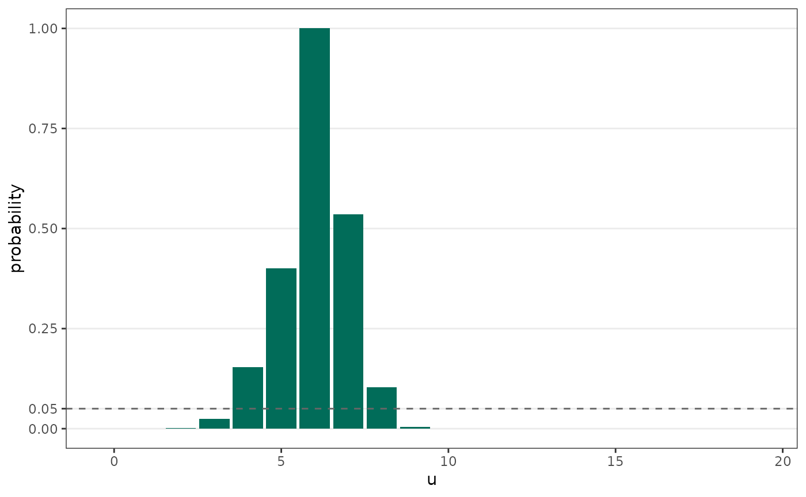

# Background and comparison

This article is the statistical background for the package, and a
comparison against base R’s
[`fisher.test()`](https://rdrr.io/r/stats/fisher.test.html) and
[`exact2x2::fisher.exact()`](https://rdrr.io/pkg/exact2x2/man/exact2x2.html).
The full derivations are in van der Meulen, Raymond and van der Meulen
(2021), building on van der Meulen (2008).

## Why a modified test

Fisher’s Exact Test fixes the total number of successes and asks only
how they split between the groups; under the null that split is
non-central hypergeometric with the odds ratio as its parameter. It
never exceeds its nominal level α, but because the data are discrete it
cannot in general hit size α exactly, so it ends up **conservative**:
its true rejection rate sits below α, and a conservative test is
underpowered.

Take a worked example with two independent binomial proportions \\u/m\\
and \\v/n\\, testing \\H_0: \theta = 1\\ where \\\theta\\ is the log
odds ratio. Given \\u=13\\, \\m=41\\, \\v=6\\, and \\n=47\\ (Example 2
from the paper), the probability distribution for \\u\\ is given by:

Fisher’s Exact Test is only *uniformly most powerful unbiased* (UMPU) if
it is allowed to **randomise** at the borderline outcomes
(e.g. randomising between \\u=\\3,4\\\\ and \\u=\\8,9\\\\), in effect
flipping a weighted coin to decide significance. That is rarely
acceptable in practice, so a non-randomised version is used instead. The
non-randomised tests all try to recover the power lost to dropping the
coin flip, and differ in how, and in whether they still strictly control
the Type I error rate:

- The **conservative / probability-based test** rejects on the summed
  probability of outcomes at least as likely as the one observed. This
  is the “exact” test in SAS Proc FREQ and base R’s
  [`fisher.test()`](https://rdrr.io/r/stats/fisher.test.html). It
  controls the size but is conservative, and its p-value and confidence
  interval can disagree (shown below).
- **Asymptotic tests** (Woolf’s) and **mid-*p*** approaches are less
  conservative but do not strictly control the size; the true size can
  be larger than α.

The **modified Fisher exact test** in this package keeps strict size
control while staying closest to the randomised UMPU test. It rejects at
a borderline outcome only when its randomisation probability exceeds a
single threshold γ₀, chosen to be as large as possible while keeping the
maximum size (over the nuisance parameter) at or below α. Its p-value
and confidence interval are **test-based**, so they agree by
construction. The [Overview of
algorithm](https://pvdmeulen.github.io/modifiedfisher/articles/overview-of-algorithm.md)
article shows how this is implemented.

## The probability-based tests in R and SAS

The probability-based tests are familiar to many practitioners.

The **two-sided p-value** uses a likelihood ordering: it sums the
probabilities of all tables no more likely than the observed one. Base
R’s [`fisher.test()`](https://rdrr.io/r/stats/fisher.test.html) and SAS
Proc FREQ use this same rule (in `exact2x2` it is
`tsmethod = "minlike"`), and it is the test implemented here as
[`pvalue_probability()`](https://pvdmeulen.github.io/modifiedfisher/reference/pvalue_probability.md).

Its **confidence interval** is calculated using a different method.
[`fisher.test()`](https://rdrr.io/r/stats/fisher.test.html) does not
invert that p-value; it uses an equal-tail (central) construction
instead, the same mismatch holds for Proc FREQ. Because the two come
from different rules, they can **disagree**: a result can be significant
by its p-value while its interval still contains an odds ratio of 1.

Two further points concern the odds-ratio **estimate**, not the test.
[`fisher.test()`](https://rdrr.io/r/stats/fisher.test.html) reports the
conditional maximum likelihood estimate, whereas this package (following
the paper) reports the sample odds ratio, so the estimates differ on
identical data. And
[`exact2x2::fisher.exact()`](https://rdrr.io/pkg/exact2x2/man/exact2x2.html)
lets you pick the two-sided method *and* pairs it with the matching
interval: with `tsmethod = "minlike"` the interval inverts the same
p-value, so the two agree - making it a suitable conservative comparator
to `modifiedfisher`.

## Side-by-side comparison

We use the paper’s Example 2: 13 of 41 in Group A versus 6 of 47 in
Group B, testing the null odds ratio of 1 at α = 0.05.

| Test | OR est. | p-value | CI lower | CI upper | OR = 1 in CI? |
|:---|---:|---:|---:|---:|:---|
| Modified FE (this package) | 3.173 | 0.034 | 1.082 | 10.249 | no |
| fisher.test() (base R) | 3.130 | 0.039 | 0.969 | 11.312 | yes |
| fisher.exact() minlike (exact2x2) | 3.130 | 0.039 | 1.038 | 9.581 | no |
| fisher.exact() central (exact2x2) | 3.130 | 0.058 | 0.969 | 11.312 | yes |

Two things stand out:

- The odds-ratio estimates differ, because
  [`fisher.test()`](https://rdrr.io/r/stats/fisher.test.html) and
  `fisher.exact()` report the conditional MLE while the modified test
  reports the sample odds ratio.
- The last two columns, read together, show the disagreement between
  p-values and confidence intervals: base R’s
  [`fisher.test()`](https://rdrr.io/r/stats/fisher.test.html) can return
  a p-value below 0.05 while its 95% interval still contains an odds
  ratio of 1, because p-value and interval use different rules. The
  `central` variant makes the equal-tail interval (and its larger
  matching p-value) explicit; the `minlike` variant pairs the
  likelihood-ordering p-value with an agreeing interval. The modified
  test, like the agreeing `exact2x2` options, never points its p-value
  and interval in opposite directions.

## Which test controls what

Strict size control here means the actual size never exceeds α for any
nuisance parameter value.

| Test | Strict size control? | Non-randomised? | p-value and CI agree? | OR estimate |
|:---|:---|:---|:---|:---|
| Randomised FE (UMPU) | yes (size = α exactly) | no | not usable | conditional MLE |
| Conservative / probability-based (base fisher.test, Proc FREQ) | yes (but conservative) | yes | no | conditional MLE |
| exact2x2 fisher.exact, minlike | yes (but conservative) | yes | yes | conditional MLE |
| Woolf asymptotic | no (can exceed α) | yes | yes | sample OR |
| Modified FE (this package) | yes (close to α) | yes | yes | sample OR |

The randomised test is optimal but unusable in practice. The
probability-based test is reproducible and controls the size, but is
conservative and can give a disagreeing p-value and interval. Woolf’s
test is self-consistent and cheap but does not strictly control the
size. The modified test is the only row that is non-randomised, strictly
size-controlling, and agreeing at once, which is what suits it to
small-sample work needing strict Type I error control. The size and
power of these tests are compared across the nuisance parameter in
[Reproducing the paper’s
figures](https://pvdmeulen.github.io/modifiedfisher/articles/reproducing-paper-figures.md).

## Unconditional exact tests

The tests compared above (Fisher’s, Woolf’s, and the modified test) are
all **conditional**: they fix the total number of successes \\T = u +
v\\ and evaluate the extremity of the observed split.

A separate class of **unconditional exact tests** does not condition on
\\T\\. These fix only the sample sizes \\m\\ and \\n\\ and work with the
full sample space of all possible \\(u, v)\\ pairs. Two key tests in
this class are Barnard’s and Boschloo’s tests.

The power advantage of unconditional tests over the modified Fisher
exact test is largest when only the sample sizes \\m\\ and \\n\\ are
fixed by design (the typical setting in a randomised trial), since
conditioning on \\T\\ in that setting restricts the sample space without
a design-based justification. The modified test’s advantage over the
standard Fisher test holds within the conditional framework.

## References

**This ‘modified’ Fisher exact test:**

van der Meulen EA, Raymond K, van der Meulen PJ (2021). *Consistent
Confidence Limits, P Values, and Power of the Non-Conservative, Size-α
Modified Fisher Exact Test.* Journal of Biostatistics and Biometric
Applications 6(1):102.

van der Meulen EA (2008). A Nonrandomized, Nonconservative Version of
the Fisher Exact Test. *Communications in Statistics - Theory and
Methods*, 37:699-708.

**The `exact2x2` package is a useful resource for comparison tests:**

Fay MP (2010). Confidence intervals that match Fisher’s exact or
Blaker’s exact tests. *Biostatistics* 11(2):373-374.
